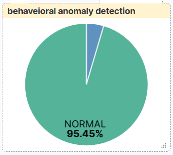
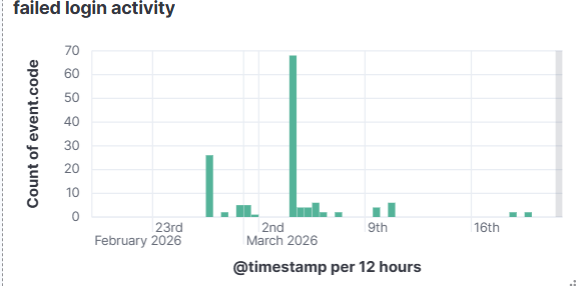
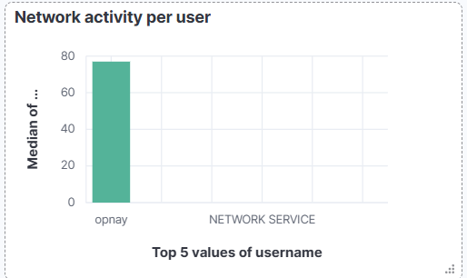

# AI-Driven SOC Monitoring System

## Overview

AI-Driven SOC Monitoring System built using Elastic Stack (Winlogbeat, Elasticsearch, Kibana) and Python. The project collects Windows security logs, performs behavioral analysis, calculates risk scores, detects anomalies, and visualizes security events through a centralized SOC dashboard.

## Features

* Real-time Windows Event Log Monitoring
* Winlogbeat Log Collection
* Elasticsearch Data Storage
* Python-Based Risk Scoring Engine
* Behavioral Anomaly Detection
* Brute Force Attack Detection
* Kibana Security Dashboards
* Automated Threat Classification

## Technology Stack

* Python
* Elasticsearch
* Kibana
* Winlogbeat
* Ubuntu WSL
* Windows Event Logs

## Project Architecture

Windows Event Logs → Winlogbeat → Elasticsearch → Python Risk Engine → user_risk_index → Kibana Dashboard

## Dashboard Screenshots

### Full Dashboard Overview

Complete SOC dashboard displaying risk scores, anomaly detection results, threat classifications, failed login activity, network activity, and process execution metrics.

### Top Risky Users

Ranks users based on calculated risk scores generated by the Python Risk Engine. Higher scores indicate potentially suspicious behavior requiring investigation.

### Threat Level Classification

Displays the distribution of LOW, MEDIUM, and HIGH threat levels calculated from user activity patterns.

### Behavioral Anomaly Detection

Statistical anomaly detection using dynamic baselines to identify unusual user behavior.

### Failed Login Activity

Tracks Windows Event ID 4625 authentication failures and helps identify brute-force attack attempts.

### Network Activity Analysis

Visualizes network connection activity for monitored users to identify suspicious communication patterns.

### Process Execution Activity

Shows process creation activity used by the risk engine to detect potentially malicious execution behavior.

### Brute Force Alert Detection

Elastic Observability alert configured to trigger when failed login attempts exceed the defined threshold.

## Risk Scoring Formula

Risk Score = (3 × Failed Logins) + (1 × Successful Logins) + (2 × Network Connections) + (4 × Process Creations)

## Future Enhancements

* Machine Learning Based Detection
* Multi-Host Monitoring
* SOAR Integration
* Threat Intelligence Feeds
* Automated Incident Response

## Author

Nayan Patel
B.Voc Cyber Security & Forensics
